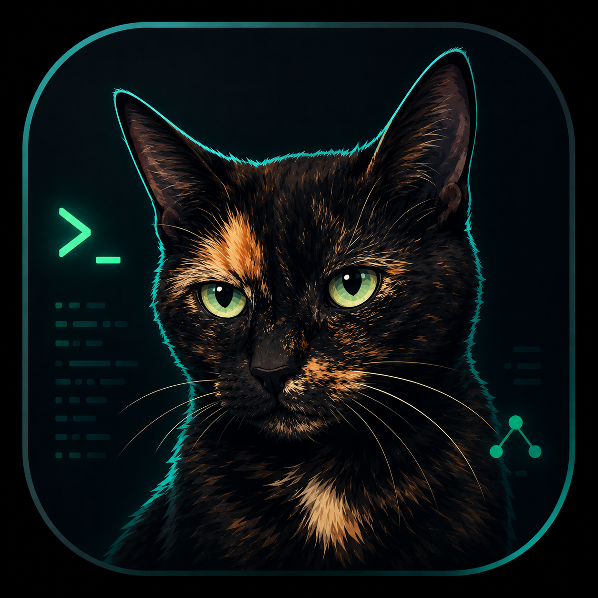

<p align="center">
  
</p>

# Junebug CLI

Junebug CLI is an open-source, local-first coding agent for Junebug models.

**Website:** <https://weeksdev.github.io/junebug-cli/>

This initial foundation intentionally defaults to read-only workspace access. It includes a provider-neutral event contract, safe read/search tools, and streaming REST support for OpenAI, OpenRouter, DeepSeek, Anthropic Claude, and local Ollama models.

## Requirements

- **[ripgrep](https://github.com/BurntSushi/ripgrep)** (`rg`) — the built-in `search` tool shells out to it. The macOS installer installs it via Homebrew; otherwise use `brew install ripgrep`, `apt install ripgrep`, or `winget install BurntSushi.ripgrep.MSVC`. Junebug warns at startup when it is missing.
- **Git** (optional) — for `git_status`/`git_diff`/`/changes`; non-Git workspaces work everywhere else.
- **Rust (cargo)** — only when building from source.

Install on macOS (builds from source, installs ripgrep if needed, installs to `~/.local/bin/junebug`):

```sh
./install-macos.sh
```

Tagged versions (`v*`) publish prebuilt binaries for macOS (arm64/x86_64), Linux, and Windows on the [GitHub releases page](https://github.com/weeksdev/junebug-cli/releases) — install ripgrep separately when using these.

Save a provider API key once (stored in `~/.junebug/credentials.env`, `0600`) and start chatting. Existing `.febo` credentials, configuration, sessions, swarm setup, and checkpoints remain readable after the rename; all new state is written under `.junebug`. When you omit `--provider` and `--model`, Junebug defaults to the provider **and model** from your last session in this workspace (falling back to whichever key it can find and the provider's default model):

```sh
junebug set --provider deepseek YOUR_API_KEY
```

Or just run `junebug` with nothing configured: it starts in no-model mode and `/keys` sets a key from inside the REPL (arrow-key provider picker, hidden input) and brings a model up on the spot — no restart. Keys never appear in session logs and are never exposed to the model.

```sh
cargo run -- --help
OPENROUTER_API_KEY=... cargo run -- "Describe this project"
OPENAI_API_KEY=... cargo run -- --provider openai --model gpt-4.1-mini "Describe this project"
DEEPSEEK_API_KEY=... cargo run -- --provider deepseek --model deepseek-v4-flash "Describe this project"
ANTHROPIC_API_KEY=... cargo run -- --provider anthropic --model claude-sonnet-4-5 "Describe this project"
ollama pull qwen3:8b
cargo run -- --provider ollama --model qwen3:8b "Describe this project"
```

Ollama is detected automatically at `http://127.0.0.1:11434`; set `OLLAMA_HOST` for another local or LAN endpoint. It needs no Junebug credential. Installed Ollama models appear alongside cloud models in `/model` and `/swarm-setup`, and `ollama:model-name` works for direct selection. Junebug uses Ollama's OpenAI-compatible streaming chat, model-list, and tool-calling APIs and disables Qwen's long thinking trace for responsive agent turns. The default `qwen3:8b` is small enough for a 16 GB Apple Silicon Mac and supports real tool calls; plain code-completion models may only print tool-shaped text and are not suitable for agent mode.

Other local OpenAI-compatible runtimes are supported as `local-openai`. Set `LOCAL_OPENAI_BASE_URL` to the server root — with or without a trailing `/v1`, both spellings work (for example an LM Studio, vLLM, or llama.cpp endpoint) — and optionally set `LOCAL_OPENAI_API_KEY`; Junebug discovers `/v1/models` and uses `/v1/chat/completions`. Aliases `lmstudio`, `vllm`, and `openai-local` are accepted.

`claude-cli` and `codex-cli` use a Claude Pro/Max or ChatGPT Plus/Pro/Codex subscription by delegating each turn to your local, already-authenticated `claude`/`codex` CLI (`claude login` / `codex login`) instead of talking to either API directly — no key needed, `has_credential` just checks the binary is on `PATH`. This is deliberately a subprocess, not a reimplemented OAuth client: subscription auth is licensed for the vendor's own official app, and Anthropic's Agent SDK docs say so explicitly ("Anthropic does not allow third party developers to offer claude.ai login or rate limits for their products"); driving the CLI you personally logged into is a different thing, and is in fact Anthropic's own documented integration path for non-Python/TS languages. Because the delegate runs its own built-in agent loop (its own file/shell tools, its own approval system), it does not participate in Junebug's tool loop, `PolicyEngine`, or per-file diffs — `stream_turn` always returns plain text with no tool calls. Junebug's permission mode is instead mapped once per turn onto each CLI's own sandbox (`read-only`/`plan` for read-only or ask, `workspace-write`/`acceptEdits` for workspace-write, full bypass for yolo — `Ask` collapses to read-only since a headless subprocess cannot be interactively prompted), and the existing pre-prompt checkpoint remains the `/rewind` safety net. Multi-turn context uses each CLI's own session resume rather than replaying history as prompt text; changing permission mode starts a fresh delegate session. Excluded from `/swarm-setup` and auto-routing (`router.rs`), which assume small pinned REST calls — still selectable from `/model` and `--provider`.

`plugin` (`--provider plugin --model <name>`, or `/model plugin:<name>`) generalizes that same idea to *any* local executable, named by a small JSON manifest at `~/.junebug/plugins/<name>.json` (a workspace `.junebug/plugins/<name>.json` overrides it) instead of two hardcoded binaries. Junebug writes one JSON request object (`prompt`, `permission`, `workspace`) to the plugin's stdin and reads exactly one JSON response object (`text`, `input_tokens`, `output_tokens`, `is_error`) from its stdout — see [PLUGIN_PROTOCOL.md](PLUGIN_PROTOCOL.md) for the full contract and a minimal reference implementation. Like `claude-cli`/`codex-cli`, a plugin runs its own complete agent loop internally (no Junebug tool calls, 10-minute timeout, killed on Esc/Ctrl-C) and is excluded from `/swarm-setup`/auto-routing the same way. This exists specifically so a **personal, never-distributed** companion program can wire in something Junebug's own open-source code deliberately never touches — most concretely, the Claude Agent SDK authenticated against your own Pro/Max subscription (`claude setup-token`) — without that program, or any credential, ever living in this repository. `/model plugin` opens a picker over every manifest it can find; `has_credential` only checks `~/.junebug/plugins/` (not workspace-level manifests, since that check takes no path) for whether to list `plugin` as "available" at all.

Use `/model` to pick from one grouped list containing the live model catalogs of every available provider; switching providers does not require a separate provider step. `provider:model` remains available for direct selection. See [PLAN.md](PLAN.md) for the release roadmap.

`/hardware` detects local unified memory (Apple Silicon), discrete VRAM (`nvidia-smi`), or falls back to system RAM, estimates a safe budget after OS/runtime headroom, and recommends the largest local model size (assuming Q4 quantization) that should run comfortably — plus a fit check against every installed Ollama/`local-openai` model. The same estimate annotates oversized models with a ⚠ hint directly in the `/model` picker, so undersized/oversized choices are visible before you switch, not after an OOM.

Automatic in-task routing is strictly opt-in: use `--model auto`, `/model auto`, or set `routing.mode` to `"auto"` in `~/.junebug/config.json` (a workspace `.junebug/config.json` overrides it). Configure `routing.routes` with band entries containing `provider` and `model`. Only available providers—credentialed cloud APIs or a reachable Ollama runtime—are offered. By default Junebug sends the routing service derived task signals—not prompts, code, filenames, diffs, or tool output. Set `routing.send_prompt` to `true` only if you explicitly want the prompt sent. The default service URL is `http://127.0.0.1:8791`; if it is unavailable, Junebug prints a notice and uses local routing rules.

The CLI uses standard provider environment variables and also reads an ignored `.env` file from the current workspace. Copy `.env.example` to `.env`; values are never printed or persisted in session logs.

## Current commands

- `junebug` — interactive REPL with a Claude Code-style terminal UI: streamed Markdown rendering, a spinner with elapsed time, `⏺ tool(args)` / `⎿ result` activity lines, and **Esc to interrupt** a running turn (the partial reply stays in context; your next message continues from it).
  - Slash commands: `/help`, `/keys` (set or replace a cloud-provider API key, input hidden), `/model` (arrow-key pick across every available provider's live model list, including Ollama), `/hardware` (detected GPU/memory and the local model size it can comfortably run), `/index` (build or refresh the local semantic-search index), `/permissions` (arrow-key switch between read-only / ask / workspace-write / **yolo** mid-session), `/rewind` (restore workspace files to an earlier checkpoint), `/compact` (model-written summary replaces old history), `/status`, `/changes` (full-screen changed-file tree and per-file diff, using real Git or the latest shadow checkpoint in a non-Git folder), `/explorer` (searchable workspace tree with syntax-highlighted file viewer and explicit tree/file pane focus; `e` opens the selected file in your `$VISUAL`/`$EDITOR` — falling back to `vi` — after taking a checkpoint, so `/rewind` covers manual edits too), `/commits` (searchable recent-commit list with an author/date/message preview; enter opens that one commit's changed files in the same browser as `/changes`, scoped to its own diff instead of the working tree), `/investigate <question>` (four-role abductive-reasoning harness — see below), `/investigate-status`, `/investigate-setup`, `/diff`, `/exit`. A dimmed status line under the prompt always shows the current model and access level.
  - Input intellisense: typing `/` opens a slash-command menu; typing `@` opens a workspace file search menu (↑/↓ select, Tab/Enter accept). Accepted `@path` mentions attach the file's contents to your message.
  - `!<command>` is a direct shell escape, not an agent tool: it runs immediately in the workspace root with your real shell, environment, and terminal (stdio inherited, so pagers/prompts/colors work normally) — no policy check, no approval prompt, no timeout or output cap, and it's never added to the conversation the model sees. It exists for you to poke around (`!git log`, `!ls`, `!npm test`) without spending a turn or exposing that ability to the agent itself; only the command text, not its output, is written to the session log.
  - Multi-line paste is safe: bracketed paste mode makes a paste arrive as one atomic event, shown as a compact `[pasted #1 +12 lines]` placeholder you can keep typing around; the full text expands into the prompt when you press Enter.
  - Line editing: arrows, Home/End, Ctrl-A/E/U/K, and ↑/↓ history. Shift+Tab cycles `read-only → ask → workspace-write → yolo` without losing typed input and also works during a running turn; the colored footer/spinner always shows the effective mode. Each in-flight tool snapshots the mode when it begins, so a change affects the next tool call rather than altering one halfway through.
- `junebug [prompt]` — single prompt execution with approval prompts for writes and commands.
- `junebug exec [--json] <prompt>` — script-friendly execution emitting JSON Lines events (`text.delta`, `tool.call`, `tool.result`, `route.selected`, `route.changed`, `completed`).
- `--permission read-only|ask|workspace-write|yolo` — defaults to `read-only`. `yolo` grants unrestricted filesystem access—including absolute/outside-workspace paths and normally protected `.env*`, `.git`, `.junebug`, and legacy `.febo` paths—lets commands inherit the launching environment, and approves every write and command without asking (plan mode still forces read-only). This can send protected files or environment secrets to the provider and local session log. Search, Git status, and Git diff accept an optional target path for work outside the startup repository. Checkpoints only cover the startup workspace, so outside-workspace changes are not rewindable. Non-interactive runs require `workspace-write` or `yolo` for edits.
- `--plan` — hard read-only guard that also hides write/command tools from the model, regardless of `--permission`.
- `--resume [session.jsonl]` — continue a session; **with no path it lists past sessions to pick from**. A given path must name an existing session file — a typo fails with an error instead of being treated as prompt text. `--resume-compact [session.jsonl]` additionally summarizes a large history first so resuming does not waste tokens. `--max-context-chars` bounds the request context with deterministic compaction.
- **Model swarms** — `/swarm-setup` assigns models from one grouped all-provider picker to three roles: a **boss** that inspects the workspace, writes a constitution + task plan, rules on disputes, and reviews the result (use your strongest model — it never writes files); a **worker** that executes each task (cheap); and a **checker** that independently verifies every task with its own tools, never trusting the worker's report (cheap). `/swarm <goal>` runs the loop: failed checks send specific feedback back to the worker (up to 2 reworks), persistent disputes escalate to the boss — which can overrule the checker — and the boss closes with an honest final report. Every step is labeled with the role and model doing it, each swarm gets its own session log, and checkpoints are taken throughout so `/rewind` can undo a swarm. Requires `ask` or `workspace-write` permission (`yolo` avoids per-step prompts). Transient provider errors (a stream dying mid-turn, a 5xx, a rate limit) retry the affected agent turn up to twice with backoff instead of aborting the run, and progress is saved to `.junebug/swarm_state.json` after planning and after every task — if a swarm still aborts, `/swarm resume` continues it from the first unfinished task. While a swarm runs, single keypresses work live (swarm agent turns run on a worker thread while the main thread renders events and watches keys, exactly like normal REPL turns): press `s` for an inline progress readout (per-task ✓/✗/pending plus the current phase), `p` to pause gracefully after the current task, or `Esc`/`Ctrl-C` to interrupt the current turn and pause immediately — the in-flight task simply reruns on resume. A spinner line shows the current phase and the available keys. `/swarm-status` prints the same readout any time (even from a second junebug in the same workspace), and `/swarm-status ai` has your current model narrate the progress from the saved state and the swarm log.
- **Abductive reasoning** — `/investigate <question>` runs a four-role harness instead of a single pass: a **generator** proposes at least five materially different explanations (forced to include a mundane, a systemic, an intentional, a measurement-error, and a contrarian one, so it can't converge on the first plausible story); an **evaluator** scores each hypothesis *blind* to the others (a fresh call per hypothesis, seeing only that one) by estimating `P(evidence|hypothesis)` and `P(evidence|¬hypothesis)`; a **skeptic** red-teams the leading hypothesis for base-rate neglect, selection bias, and hidden assumptions; and a **synthesizer** writes the final answer under fixed FACT/INFERENCE/UNCERTAINTY/ALTERNATIVES/DISCRIMINATOR headings. The actual Bayesian posterior update is deterministic Rust arithmetic (log-odds accumulation of likelihood ratios), never a model computing its own confidence — the model only ever supplies the likelihood estimates. Every role is forced read-only regardless of the active permission mode, so unlike `/swarm` this works even under `read-only` permission or `--plan`. Roles default to the currently active provider/model with zero setup; `/investigate-setup` optionally assigns a different model per role (routing the skeptic to a different model family, e.g. `claude-cli`/`codex-cli`, gives it less-correlated errors from the generator). Progress is saved to `.junebug/investigations/<id>.json` after each phase; `/investigate-status [id]` prints the ranked hypotheses and synthesis of the most recent (or a named) investigation. See `INVESTIGATE_MODE_PLAN.md` for the design spec.
- **File-change diffs** — every file write shows what changed: colored `-`/`+` line hunks with context appear in the REPL activity stream under the tool line, in `ask`-mode approval prompts (so you see exactly what you're approving before answering y/N), and as `file.diff` events in `exec --json`. Diffs are display-only and are never sent to the model.
- **Workspace checkpoints** — before every prompt, file write, and command, Junebug snapshots the workspace into a shadow Git repository under `~/.junebug/checkpoints/` (existing `~/.febo/checkpoints/` histories remain usable; your own repo is never touched; works in non-Git workspaces). `/rewind` restores files to any checkpoint, and the pre-restore state is checkpointed first so a rewind is always undoable. Snapshots respect your `.gitignore` and never capture `.env*`, `.junebug/`, legacy `.febo/`, or build caches. Disable with `--no-checkpoints`.
- `--enable-hooks` — run explicitly trusted `.junebug/hooks.json` lifecycle commands.
- `--enable-mcp` — connect local stdio MCP servers from `.junebug/mcp.json`; every MCP tool call requires an interactive approval showing the arguments.
- `junebug --version` / `junebug --help`.

Sessions are recorded locally in `.junebug/sessions/` as JSON Lines, and legacy `.febo/sessions/` remain resumable. Cloud providers receive prompts over HTTPS; Ollama requests stay on the configured `OLLAMA_HOST` endpoint. Built-in workspace tools can list directories, read files, search with ripgrep, search by meaning (`semantic_search`, local embeddings via Ollama), create/replace files (including new nested directories), inspect Git status/diffs, propose a shell command, search the web (`web_search`, DuckDuckGo, no API key), track a plan (`write_todos`), and delegate a self-contained sub-task to an isolated sub-agent (`task`).

`semantic_search` finds code by what it *does* rather than what it's literally named, using a local Ollama embedding model (`ollama pull nomic-embed-text` or another embedding model — Junebug picks the first installed model whose name looks like one). It builds a per-workspace index at `.junebug/semindex.jsonl` on first use; `/index` builds or refreshes it explicitly and only re-embeds files whose content actually changed since the last build, so repeat runs after small edits are fast. Everything stays on the local Ollama endpoint — nothing is sent to a third party. Web searches send the query text to DuckDuckGo, so outside `yolo` every call requires an interactive approval that shows the exact outgoing query; plan mode denies them entirely. Git inspection reports cleanly when the workspace is not a Git repository. Commands are killed — together with every descendant process — after a timeout the model can set per call (`timeout_seconds`, 1–3600; default 120), so a foreground server or stuck build can never hang a turn or a swarm. Outside `yolo`, commands require interactive approval and destructive/network patterns get an explicit ⚠ warning in the approval prompt; yolo bypasses both. Every tool call is gated by a deterministic policy engine before it runs. Outside `yolo`, `.env*`, `.git`, `.junebug`, and legacy `.febo` paths are protected at any depth and symlinks may not escape the workspace. Repository hooks and MCP servers stay disabled unless explicitly enabled per run. Remote MCP and plugins are not available yet.

`write_todos` and `task` are the two "deep agent" tools: the model uses `write_todos` to lay out and update a checklist for a multi-step task (each call replaces the previous list; the rendered checklist is the tool result, so it shows up as ordinary tool activity), and `task` to delegate a self-contained chunk of work to a fresh sub-agent with the same tools and permissions but its own isolated conversation — the parent never sees the sub-agent's intermediate tool calls (they show up as dim out-of-band `⟳` notices instead of inline activity), only its final answer comes back as the tool result. This keeps the parent's own context clean on large investigations ("find every caller of X and summarize") instead of filling it with every intermediate search. Sub-agents get their own session log under `.junebug/sessions/`, cannot spawn further sub-agents or touch the shared todo list, and inherit the exact same policy engine and approval flow as the parent, so plan mode and permission mode apply to everything they do exactly as if the parent had done it directly.

## License

Junebug is dual-licensed under your choice of the [MIT License](LICENSE-MIT) or the [Apache License 2.0](LICENSE-APACHE).
